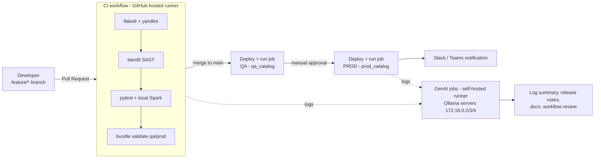

# RTB C16 Case Study - GitHub Actions CI/CD for Databricks with GenAI

**Scenario chosen:** Databricks ETL job deployment (Bronze -> Silver -> Gold) using **GitHub Actions**,
**Databricks Asset Bundles**, two environments (**QA** and **PROD**) and **GenAI (company Ollama servers)**
for log summaries, release notes, documentation and workflow review.

---

## 1. Architecture



### Why catalogs instead of workspaces?
Databricks **Free Edition** gives only **one workspace**. Environments are separated with **Unity Catalog catalogs**:

| Environment | Bundle target | Catalog        | Job name                    | Deployed folder                          |
|-------------|---------------|----------------|-----------------------------|------------------------------------------|
| QA          | `qa`          | `qa_catalog`   | `[qa] Sales ETL Job`        | `~/.bundle/sales_etl/qa`                 |
| PROD        | `prod`        | `prod_catalog` | `[prod] Sales ETL Job`      | `~/.bundle/sales_etl/prod`               |

Each catalog gets the schema `sales` with tables `bronze_orders`, `silver_orders`, `gold_sales_summary`.

---

## 2. Project structure

```
databricks-cicd-genai/
├── .github/workflows/
│   ├── ci.yml                          # Lint, SAST, unit tests, bundle validation, AI log summary
│   ├── cd.yml                          # QA -> approval -> PROD, AI release report, notification
│   └── reusable-databricks-deploy.yml  # Reusable deploy steps (used for QA and PROD)
├── databricks.yml                      # Databricks Asset Bundle: targets qa / prod
├── resources/sales_etl_job.yml         # Databricks job (5 tasks, serverless)
├── src/
│   ├── transformations.py              # Business logic (unit tested)
│   ├── 00_setup.py                     # Creates catalog + schema
│   ├── 01_bronze_ingestion.py          # Raw data -> bronze
│   ├── 02_silver_transformation.py     # Cleaning -> silver
│   ├── 03_gold_aggregation.py          # Aggregation -> gold
│   └── 04_data_validation.py           # Quality gate (fails job on bad data)
├── tests/                              # pytest unit tests (local Spark)
├── scripts/ai_assistant.py             # GenAI helper (Ollama REST API, stdlib only)
├── requirements-dev.txt, pytest.ini, .flake8, .yamllint.yml, .gitignore, .gitattributes
```

---

## 3. Databricks Free Edition constraints (and how this project handles them)

| Constraint | How it is handled |
|------------|-------------------|
| Only **one workspace** | QA/PROD separated by catalogs (`qa_catalog`, `prod_catalog`) and bundle targets |
| **Serverless compute only** (no custom clusters) | Job tasks define **no cluster** -> Databricks runs them on serverless |
| Python/SQL only on serverless; no RDD / `sparkContext` / `.cache()` | Code uses DataFrame API only |
| No DBFS root / external cloud storage | Sample data is built into the code; output is **Unity Catalog managed tables** |
| Limited compute quota and concurrency | Small dataset, `max_concurrent_runs: 1`, QA and PROD run one after another |
| Restricted outbound internet from Databricks | AI calls happen on the **GitHub runner**, never from Databricks |
| Service principals / OAuth setup is heavy | Uses a **Personal Access Token (PAT)** stored in GitHub Secrets |

---

## 4. Milestone mapping

| Milestone | Where it is implemented |
|-----------|-------------------------|
| M1 - Workflows, jobs, runners, triggers, secrets, branching | `ci.yml` (pull_request / push / workflow_dispatch / workflow_call), `cd.yml` (push to main), GitHub-hosted + self-hosted runners, secrets & variables, `concurrency` |
| M2 - Build & test, linting, static analysis | flake8, yamllint, pytest with local Spark, `databricks bundle validate` |
| M3 - Data platform deployment | Databricks Asset Bundle deploy + job run via Databricks CLI (`databricks/setup-cli`) |
| M4 - Security, notifications, approvals | GitHub Secrets, least-privilege `permissions`, bandit SAST, secret redaction before AI, Slack/Teams webhook, `prod` environment with required reviewers |
| M5 - GenAI | `scripts/ai_assistant.py`: log summarization, release notes/changelog, documentation, workflow review, workflow generation |

---

## 5. Step-by-step setup

### Step 1 - Databricks Free Edition
1. Sign up at Databricks Free Edition and open your workspace.
2. Copy the workspace URL, e.g. `https://dbc-xxxxxxxx-xxxx.cloud.databricks.com` -> this is **DATABRICKS_HOST**.
3. Create a token: **Profile (top-right) > Settings > Developer > Access tokens > Generate new token** -> this is **DATABRICKS_TOKEN**.
4. (Recommended) Create the two catalogs once: **Catalog > + > Create catalog** -> `qa_catalog`, then `prod_catalog`.
   The setup notebook also tries `CREATE CATALOG IF NOT EXISTS`, so this is only a fallback.

### Step 2 - GitHub repository
1. Create a new GitHub repository and push **the contents of this folder** as the repository root
   (the `.github` folder must be at the root).
   ```powershell
   cd databricks-cicd-genai
   git init -b main
   git add .
   git commit -m "Initial commit: Databricks CI/CD with GenAI"
   git remote add origin https://github.com/<your-user>/<your-repo>.git
   git push -u origin main
   ```
2. Create a `develop` branch for day-to-day work (see branching strategy below).

### Step 3 - Secrets (Settings > Secrets and variables > Actions > **Secrets**)

| Secret | Required | Value |
|--------|----------|-------|
| `DATABRICKS_HOST` | Yes | Workspace URL |
| `DATABRICKS_TOKEN` | Yes | Personal access token |
| `NOTIFY_WEBHOOK_URL` | Optional | Teams **Workflows** webhook URL ("Send webhook alerts to a channel") or Slack incoming webhook |
| `OLLAMA_USERNAME` / `OLLAMA_PASSWORD` | Optional | Only if the Ollama API is behind a login proxy. **Never** put these in code |
| `GEMINI_API_KEY` | For AI | Free key from https://aistudio.google.com/apikey |

### Step 4 - Variables (Settings > Secrets and variables > Actions > **Variables**)

| Variable | Example | Purpose |
|----------|---------|---------|
| `ENABLE_AI` | `true` | Turns the GenAI jobs on |
| `AI_PROVIDER` | `gemini` (default) / `ollama` | `gemini` = Google Gemini API on GitHub-hosted runners (no VPN). `ollama` = self-hosted runner |
| `GEMINI_MODEL` | `gemini-3.7-flash` | Optional first model. Fallback order: gemini-3.7-flash, gemini-3.5-flash-lite, gemini-3.8-flash |
| `OLLAMA_URLS` | `http://172.18.0.2:11434,http://172.18.0.3:11434,http://172.18.0.4:11434` | Servers tried in order (failover) |
| `OLLAMA_MODEL` | `llama3` | Preferred model; if missing, the first installed model is used |
| `PYTHON_CMD` | `py` (Windows) / `python3` (Linux) | Python command on the self-hosted runner (default `python`) |

### Step 5 - Environments (Settings > Environments)
1. Create environment **`qa`** (no rules).
2. Create environment **`prod`** and enable **Required reviewers** (add yourself or your lead).
   PROD deployment will pause until someone approves.
   > Note: required reviewers are free for **public** repos; private repos need GitHub Team/Enterprise.

### Step 6 - GenAI provider

**Option A (recommended, no VPN needed): Google Gemini API (free tier).**
1. Create a free API key at https://aistudio.google.com/apikey.
2. Add it as the repository **secret** `GEMINI_API_KEY` and set the variable `ENABLE_AI=true`.
   The AI jobs then run on `ubuntu-latest`.

Run it locally (VPN **off**):
```powershell
$env:AI_PROVIDER = "gemini"
$env:GEMINI_API_KEY = "<your key>"   # never commit this
py scripts/ai_assistant.py check
py scripts/ai_assistant.py review-workflows --output ai_reports/workflow_review.md
```

**Option B: company Ollama servers (self-hosted runner, needs VPN).** Set `AI_PROVIDER=ollama`.
The Ollama servers (`172.18.0.x`) are on the **company network**, which GitHub-hosted runners cannot reach.
1. On a machine inside the company network/VPN: **Settings > Actions > Runners > New self-hosted runner** and follow the commands shown (Windows or Linux).
2. Install **Python 3.9+** and **Git** on that machine.
3. Test the AI servers from that machine:
   ```powershell
   py scripts/ai_assistant.py check
   ```
   Expected: `[OK] http://172.18.0.2:11434 -> models: llama3:latest ...`
4. If the check times out, the Ollama port (11434) is not exposed. Open an SSH tunnel with the provided
   server login and point the script to it:
   ```powershell
   ssh -L 11434:localhost:11434 impadmin@172.18.0.2
   # in another terminal:
   $env:OLLAMA_URLS = "http://localhost:11434"
   py scripts/ai_assistant.py check
   ```
   (For the runner, set the repository variable `OLLAMA_URLS` to `http://localhost:11434`.)

### Step 7 - Run the pipeline
1. Create a feature branch, change something, push, open a PR to `main` -> **CI** runs.
2. Merge the PR -> **CD** runs: CI -> QA deploy + job run -> approval -> PROD deploy + job run -> AI reports -> notification.
3. Download AI reports from the run page: **Artifacts > ai-reports-ci / ai-reports-release**
   (they are also shown on the run **Summary** page).

---

## 6. Branching strategy

```
feature/<name>  --PR-->  main  --(auto)-->  QA  --(approval)-->  PROD
     |
  CI runs on push and on the PR
```
- `feature/**` and `develop` pushes: CI only (no deployment).
- Pull request to `main`: CI must pass before merging (enable branch protection: **Settings > Branches > Require status checks**).
- Push/merge to `main`: full CD.

---

## 7. GenAI features (`scripts/ai_assistant.py`)

| Command | Used in | Output |
|---------|---------|--------|
| `check` | CI + CD | Server/model connectivity |
| `summarize-logs` | CI (test logs), CD (deploy/run logs) | `ci_log_summary.md`, `deployment_report.md` |
| `release-notes` | CD | `release_notes.md` (changelog from git history) |
| `generate-docs` | CD | `pipeline_documentation.md` |
| `review-workflows` | CI | `workflow_review.md` (validation + optimization tips) |
| `generate-workflow` | Local (manual) | Draft YAML for a new workflow |

Design choices:
- **Failover** across the three Ollama servers.
- **Secrets are redacted** (Databricks host/token, `dapi...` tokens) before anything is sent to the AI.
- **AI never blocks deployment**: AI jobs use `continue-on-error`; if all servers are down a non-AI fallback report is written.
- Every AI report carries a "review before publishing" note (human validation).

Local examples (PowerShell):
```powershell
py scripts/ai_assistant.py check
py scripts/ai_assistant.py review-workflows --output ai_reports/workflow_review.md
py scripts/ai_assistant.py release-notes --max-commits 10
py scripts/ai_assistant.py generate-workflow --description "Nightly workflow that runs the Databricks job in prod at 2 AM"
```

---

## 8. Run checks locally (optional)
Requires Python 3.11 and Java 17 (PySpark 3.5 does not support Python 3.13+).
```powershell
py -3.11 -m pip install -r requirements-dev.txt
py -3.11 -m flake8 src tests scripts
py -3.11 -m yamllint .github databricks.yml resources
py -3.11 -m bandit -r src scripts -ll
py -3.11 -m pytest
```
Deploy manually with the Databricks CLI:
```powershell
databricks configure            # enter host + token once
databricks bundle validate -t qa
databricks bundle deploy -t qa
databricks bundle run -t qa sales_etl_job
```

---

## 9. Demo script (for the presentation)
1. **Problem & architecture** - show the diagram and the "catalogs instead of workspaces" table.
2. **Code walkthrough** - `databricks.yml` (targets), `resources/sales_etl_job.yml` (serverless tasks), `src/transformations.py`.
3. **CI** - open a PR; show lint, bandit, pytest, bundle validate passing.
4. **GenAI** - show `ci_log_summary.md` and `workflow_review.md` on the run summary page.
5. **CD** - merge; show QA deploy + job run; **approve** PROD; show the PROD run.
6. **Databricks** - Catalog Explorer: `qa_catalog.sales.gold_sales_summary` and `prod_catalog.sales.gold_sales_summary`; Jobs page: `[qa]` and `[prod]` jobs.
7. **GenAI release report** - `release_notes.md`, `deployment_report.md`, `pipeline_documentation.md`.
8. **Failure demo (optional)** - change a test expectation, push, show the AI explaining the failing test.
9. **Security** - no credentials in code, secrets redacted, least-privilege permissions, approval gate.

---

## 10. Do's and Don'ts compliance

| Guideline | How |
|-----------|-----|
| No hard-coded credentials | All credentials come from GitHub Secrets; `.gitignore` blocks `.env` / `.databrickscfg` |
| Only reviewed/official actions | `actions/*` and `databricks/setup-cli` only |
| Meaningful names | Workflows, jobs and steps are named by purpose; jobs prefixed with `[qa]` / `[prod]` |
| Dry-run before production | `bundle validate` in CI, QA deploy + data validation before PROD |
| AI output reviewed | AI reports are artifacts with a review note; generated YAML is a draft only |
| Modular & reusable | `reusable-databricks-deploy.yml` and `ci.yml` are called via `workflow_call` |

---

## 11. Troubleshooting

| Problem | Fix |
|---------|-----|
| `Catalog 'qa_catalog' does not exist and could not be created` | Create the catalog once in the UI (Step 1.4) |
| `bundle validate` skipped with a warning | `DATABRICKS_HOST` / `DATABRICKS_TOKEN` secrets are missing |
| AI job stays "Queued" | Self-hosted runner is offline -> start it, or set `ENABLE_AI=false` |
| `[FAIL] ... timed out` in `check` | Connect to VPN or use the SSH tunnel (Step 6.4) |
| `python` not found on Windows runner | Set variable `PYTHON_CMD=py` |
| PROD job waits forever | It is waiting for approval in the `prod` environment - click **Review deployments** |


## CI/CD Test
 
Testing GitHub Actions CI/CD pipeline.